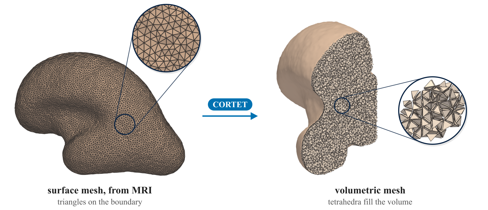
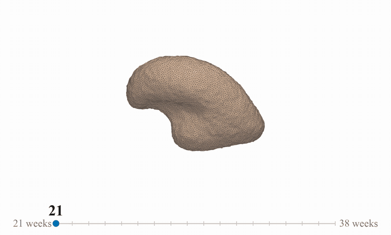
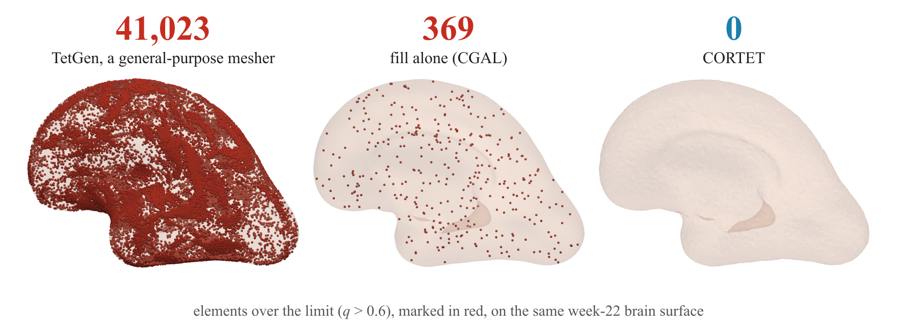
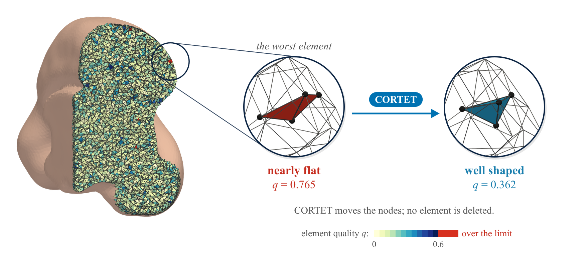
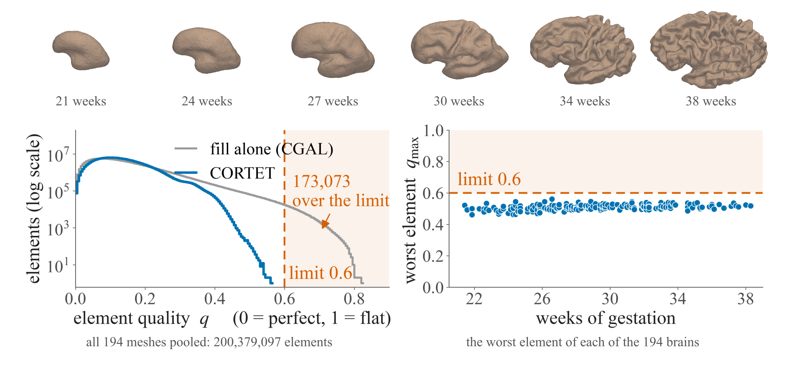
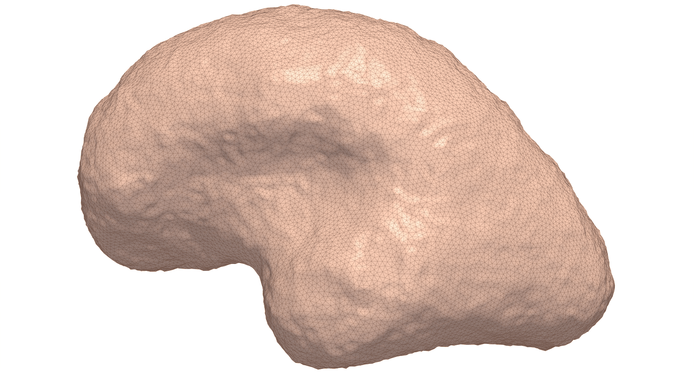
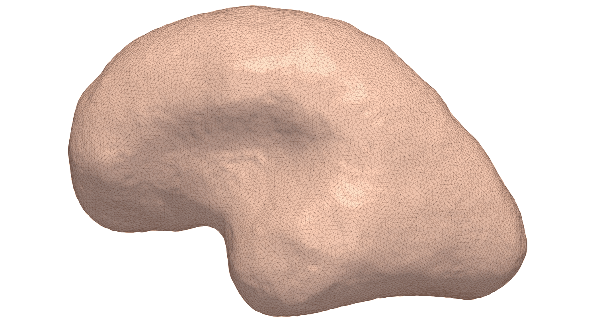

# CORTET: CORtical TETrahedral meshing

[](https://arxiv.org/abs/2607.12157)
[](https://cbm.mech.uwa.edu.au/CBM2026/)
[](LICENSE)



*From an individual cortical surface (left, with its triangles close up) to a solver-ready volumetric mesh
(right, cut open; the close-up shows tetrahedra from the cut face, drawn slightly apart). Week-22 fetal brain,
cell size `h = 0.6` mm.*

An automated pipeline that turns an individual triangulated cortical surface into a solver-ready
tetrahedral mesh, without manual repair. It was built for fetal cortical-folding simulation, where a
single degenerate element is enough to make a run unusable, so the pipeline certifies the **worst**
element rather than the average.

CORTET is part of **Gen2020**, an ongoing programme of work on the biomechanics of fetal cortical
folding at King's College London: finite-element simulation of the developing brain driven by
subject-specific dHCP imaging, toward mechanical digital twins of neurodevelopment. This repository
is the meshing infrastructure that work depends on.

The design target is a worst-element quality of `q_max < 0.6` under `meshtool`'s `tet_qmetric_volume`
measure, on which `0` is a regular tetrahedron and `1` a degenerate one.

> **Status.** Accepted at the MICCAI 2026 workshop *Computational Biomechanics for Medicine* (CBM XXI),
> Strasbourg, 27 September 2026: *CORTET: Robust generation of simulation-ready tetrahedral meshes of the
> fetal cerebral cortex*, preprint [arXiv:2607.12157](https://arxiv.org/abs/2607.12157). Please cite the
> paper; `CITATION.cff` (or *Cite this repository* on GitHub) has the entry, and the proceedings DOI will
> be added when it is issued.

**`docs/PAPER_MAP.md` maps every claim the paper makes onto the file here that backs it**, and marks
which numbers were re-measured and which were not. Start there if you are checking the work rather
than running it.

## At a glance



*The application. In the 17 weeks from 21 to 38 weeks of gestation, a smooth fetal brain becomes folded.
Each frame is a CORTET mesh of a real fetal brain (dHCP), one brain per week, on one camera and one scale;
different weeks are different fetuses.*

**The worst element decides.** A single nearly flat element can halt an explicit solver, however good the
average element is. Elements over the limit (`q > 0.6`) on the same week-22 surface:



**CORTET finds them and fixes them.** The worst element left by the fill, nearly flat at `q = 0.765`, is
reshaped to `q = 0.362` by moving its nodes. No element is deleted and the connectivity is unchanged.



**Every brain, one setting.** Across 194 fetal brains from 21 to 38 weeks, 173,073 of 200,379,097 elements
are over the limit after the fill alone, and none after CORTET; the worst element of every brain lies
between 0.46 and 0.56 ([`results/pooled_hist.csv`](results/pooled_hist.csv),
[`results/cohort_quality_194.csv`](results/cohort_quality_194.csv)).



`docs/figures/README.md` records how each of these figures was made.

## What it does

Six stages, from a GIfTI surface to a solver-ready volume mesh. Stages 3, 4 and 6 are optional and can
be bypassed so the output matches a given target solver.

| Stage | Step | Tool |
|---|---|---|
| S1 | Delaunay refinement of the volume, under all four CGAL optimisation passes | CGAL, via `pygalmesh` |
| S2 | Convert to CARP format | `meshio` |
| S3 | Global vertex smoothing, 5 passes (optional) | Gmsh `Relocate3D` |
| S4 | Worst-element quality cleaning, 3 passes at `q > 0.7, 0.5, 0.3` (optional) | `meshtool` |
| S5 | Solver-ready export: boundary faces, node ordering, conventions | this package |
| S6 | Snap boundary to the input surface (optional) | this package |

The single control is the cell size `h`: the upper bound CGAL places on each tetrahedron's
circumradius and on the surface Delaunay ball radius, with facet distance `h/2`. The default is
`h = 0.6` mm, the resolution at which the cohort results were produced.

**Post-mesh boundary smoothing**, for solvers that resolve a growing free surface, sits outside that
chain and is provided separately (see below).

## Layout

```
run/                                        the numbered entry points -- start here
  00_check_environment.py                   prove the toolchain works before trusting a number
  01_smooth_surface.py                      pre-mesh surface smoothing
  02_generate_mesh.py                       full CORTET, without post-mesh smoothing
  03_ablation.py                            CGAL only / +Gmsh / Full  (Table 1)
  04_tetgen_baseline.py                     TetGen comparison, optionally through our S3+S4
  05_postmesh_smooth_and_clean.py           boundary smoothing + the required re-clean
  06_export_braingrowth.py                  solver-ready export, conventions verified
cortet/
  common.py                                 shared mesh I/O, orientation and measurement
  surface/                                  BEFORE meshing: prepare the input surface
    smooth_one_multi_N.py                   surface-preserving Laplacian smoothing sweep
  generation/generate_tetrahedral_mesh.py   Stages 1 to 6: surface in, solver-ready mesh out
  export/                                   AFTER meshing: hand the mesh to a different solver
    export_mesh_formats.py                  Abaqus, FEBio, FEniCS, VTK, Gmsh, CARP, via meshio
  tetgen/                                   the TetGen comparison workers
    tetgen_generate.py                      TetGen generation, writes CARP
    tetgen_s3s4.py                          our S3 + S4 applied to TetGen output
  postmesh/                                 AFTER meshing: optional boundary smoothing
    run_full_postmesh_pipeline.py           the entry point: smooth, re-clean, finalise, verify
    smooth_mesh_boundary_surfacepreserving.py   pymeshlab surface-preserving Laplacian
    smooth_mesh_boundary_wb.py                  Connectome Workbench smoothing
    mesh_to_carp_and_clean.py               format conversion and meshtool cleaning
    finalize_for_braingrowth.py             writes the three-section solver format
  verify/                                   independent checks, none of which modify a mesh
    check_node_reordering.py                confirms surface-first node ordering
    check_boundary_displacement.py          boundary drift against the input surface
    compare_roughness_gii_vs_mesh.py        boundary roughness
    compare_h_direct.py                     resolution comparison
data/
  README.md                                 what is included, what is not, and why
  example_surface_smoothing/                cost of each smoothing iteration count, one subject
results/
  README.md                                 what each file is, and the caveats on the matrix
  cohort_quality_194.csv                    per-subject quality for the 194-subject cohort
  pooled_hist.csv                           pooled per-element quality distribution
  table2_h_resolution_study.csv             three subjects at h = 0.4 / 0.6 / 0.8
  table2_full_matrix.csv                    the wider matrix Table 2 was checked against
  figures/                                  boundary before/after post-mesh smoothing
docs/
  PAPER_MAP.md                              which script backs which claim in the paper
  ENVIRONMENT.md                            environment requirements and how to rediscover them
```

## Scope: this is the meshing pipeline, not the solver

The repository covers everything from an input cortical surface to a solver-ready tetrahedral mesh:
surface smoothing, tetrahedralisation, quality optimisation, solver-ready export, and the optional
post-mesh boundary smoothing with its re-cleaning and verification.

The finite-element solver is **not** included. The folding simulations reported in the paper use our own
implementation of the BrainGrowth model of Wang et al. (2021); the reference implementation is at
<https://github.com/rousseau/BrainGrowth>.

## Installation

```bash
pip install -r requirements.txt
```

Two dependencies are **not** installable through pip and must be provided separately:

- **`meshtool`** for Stage 4 quality cleaning. Expected at `~/meshtool/meshtool` by default; override
  with `--meshtool`.
- **`wb_command`** (Connectome Workbench) for surface resampling and the Workbench smoothing method.

`pygalmesh` must be built against the CGAL headers on your system. `docs/ENVIRONMENT.md` records the
exact versions used during development.

> **Read `docs/ENVIRONMENT.md` before the first run.** `meshtool` can exit with status 0 and produce
> empty or wrong output when run outside the correct environment, with no error pointing at the cause.

---

# Running it, stage by stage

`run/` holds seven numbered entry points. Each does **one** thing, prints what it did, writes a small
CSV summary, and can be run and checked on its own. Run them in order the first time; after that use
whichever you need.

They are thin, deliberately: the real work stays in `cortet/`, and the numbered scripts add the parts
that make a stage checkable — sane defaults, the expected published values to compare against, and a
verdict. Every stage measures quality through the same code path (`cortet/common.py`), so numbers from
different stages are directly comparable. They did not used to be, and two of this project's
measurement incidents came from exactly that.

| | Stage | What it does | Needs |
|---|---|---|---|
| `00` | `check_environment.py` | proves the toolchain works before you trust any number | — |
| `01` | `smooth_surface.py` | pre-mesh surface smoothing (§3.5) | pymeshlab |
| `02` | `generate_mesh.py` | full CORTET, S1–S6, **without** post-mesh smoothing | pygalmesh, gmsh, meshtool |
| `03` | `ablation.py` | CGAL only / +Gmsh / Full — the paper's Table 1 | as 02 |
| `04` | `tetgen_baseline.py` | TetGen on the same surface, and optionally through our S3+S4 | tetgen, pyvista |
| `05` | `postmesh_smooth_and_clean.py` | boundary smoothing + the re-clean it requires (§4.4) | as 02, + wb_command for `--method wb` |
| `06` | `export_braingrowth.py` | solver-ready export, every convention applied **and verified** | meshtool (optional) |

Everything takes `--help`.

### 00 — check the environment

```bash
python3 run/00_check_environment.py --meshtool ~/meshtool/meshtool
```

Run this first on any new machine. It reports every dependency and marks which stage needs it, so a
missing optional package does not read as a broken install. Then it does the check that matters: it
measures a **single regular tetrahedron**, whose quality must come back near 0.

That check exists because `meshtool` can exit 0 and emit empty or wrong output outside the correct
module environment, with nothing pointing at the cause. Verifying the binary exists is not enough.
Exit code 0 means every required item passed.

### 01 — pre-mesh surface smoothing

```bash
python3 run/01_smooth_surface.py --surface sub-X_left_white.surf.gii \
    --out-dir smoothing/ --ga 21.9
```

Defines the stress-free reference configuration the folding simulation needs. Writes one surface per
iteration count plus a metrics CSV, then reports which N removed the most noise while staying inside
both sanity caps (area loss ≤ 6 %, drift ≤ 0.25 mm).

How much smoothing a surface tolerates falls sharply with gestational age — a young, near-smooth
cortex is mostly noise, an older folded one deflates fast and its curvature is real anatomy. `--ga`
picks a starting band; `--N` overrides it. Look at the results before committing:
`wb_view smoothing/*.surf.gii`.

### 02 — full CORTET, without post-mesh smoothing

```bash
python3 run/02_generate_mesh.py --surface smoothing/sub-X_sp30.surf.gii \
    --out-dir meshes/ --meshtool ~/meshtool/meshtool
```

S1–S5, plus S6 under `--reproject`. This is the pipeline as the cohort results were produced, and the
right stage for most target solvers. Defaults to `h = 0.6` mm, the paper's default resolution.

It measures the result and **passes or fails it** against `q_max < 0.6`. Where it recognises the
subject and resolution it also prints the published values side by side, which makes the run a
reproduction check rather than just a run.

### 03 — the stage ablation

```bash
python3 run/03_ablation.py --surface sub-X_sp30.surf.gii \
    --out-dir ablation/ --with-tetgen
```

Meshes the same surface three times — CGAL only, + Gmsh, full — and measures all three identically.
This is Table 1, and it is the paper's central argument in one command: the mean barely moves
(0.135 → 0.129) while the count of solver-breaking elements collapses from ~1.7 × 10⁵ to zero. A mesh
can have excellent mean quality and be unusable, and the mean will not tell you.

Reporting that count needs `meshtool`'s per-element dump; the summary line alone cannot produce it.
Three full meshing runs per subject, so start with one young subject at the default resolution.
Meshes are measured and deleted as it goes, so disk never holds more than one.

### 04 — the TetGen baseline

```bash
python3 run/04_tetgen_baseline.py --surface sub-X_sp30.surf.gii --out-dir ablation/
python3 run/04_tetgen_baseline.py --surface sub-X_sp30.surf.gii --out-dir ablation/ --with-s3s4
```

TetGen out-of-the-box on the same surface, measured the same way: the controlled comparison that
isolates the generator from the geometry. Switches are `pq1.2/20Y` on a PyVista surface prepared with
consistent, auto-oriented normals — the configuration behind the published baseline. Changing them
breaks comparability, and the script says so.

`--with-s3s4` goes further and pushes TetGen's output through **our own** S3 and S4, asking whether
the optimisation stages rather than the choice of tetrahedraliser carry the result.

> If a quality value ever comes back outside `[0, 1]`, the input is malformed rather than merely poor.
> That is not hypothetical: TetGen run without the normal-consistency prep returned `q_max = 2.0` here.
> `cortet/common.py` now flags it explicitly.

### 05 — post-mesh smoothing and re-cleaning

```bash
python3 run/05_postmesh_smooth_and_clean.py \
    --mesh meshes/sub-X_h0.6.mesh --gii smoothing/sub-X_sp30.surf.gii \
    --out-dir postmesh/ --meshtool ~/meshtool/meshtool
```

Only for solvers that advance a growing free surface — see the section below. Two rules are enforced
rather than documented: it always re-cleans after smoothing, and it **refuses to run** if you ask for
a third cleaning pass at 0.3, which was tested and does not converge.

`--method wb` reproduces the published §4.4 figures exactly. The default,
`--method surfacepreserving`, is corroborated across the 36-combination regeneration matrix.

See `results/figures/` for what this step actually does to a boundary.

### 06 — export to the solver, with everything verified

```bash
python3 run/06_export_braingrowth.py --mesh meshes/sub-X_h0.6.mesh \
    --out-dir solver_ready/ --meshtool ~/meshtool/meshtool
```

The last stage. It applies the five silent conventions, then **re-opens the written file and tests
each one on the file itself** — because checking that the finaliser exited 0 is not the same as
checking that its output has the properties the solver depends on. It exits non-zero if any check
fails, so a batch script cannot walk on with a bad mesh.

It also repairs a trap worth knowing about. The finaliser is *convention-preserving*: it undoes the
n3↔n4 swap on read and re-applies it on write. Hand it a mesh in the standard positive orientation —
from TetGen, from a plain Delaunay triangulation, from another group's mesher — and it will
faithfully preserve that, giving you correct faces, correct node ordering, and a file that is still
not in the convention the solver reads. Nothing errors. Stage 06 detects the incoming convention,
reports it, and normalises before finalising.

---

## Post-mesh boundary smoothing, and when you need it

CGAL's optimisation passes leave a degree of faceting on the mesh boundary. This is **not** a defect for
most purposes, and most users will not need this step.

It matters for solvers that advance a **growing free surface**, where the folds arise from an
instability of that surface, so boundary faceting perturbs the very surface being computed.

| Before | After |
|---|---|
|  |  |

Subject `subject_GA21.86_left`, GA 21.86 weeks, left hemisphere, lateral view, wireframe over the shaded
boundary. Same shape, same sulcal groove — the anatomy is not being reshaped. What changes is the
tessellation: the faceting Delaunay refinement leaves behind, visible on the surface and along the
silhouette, is gone in the right-hand panel while the fold remains. Details in
`results/figures/README.md`.

For those targets, run:

```bash
python3 run/05_postmesh_smooth_and_clean.py \
    --mesh   your_mesh.mesh \
    --gii    your_input_surface.surf.gii \
    --method wb \
    --meshtool ~/meshtool/meshtool \
    --out-dir postmesh/
```

Two points that are not optional:

1. **Always re-clean after smoothing.** Smoothing moves boundary vertices away from the positions
   around which the earlier cleaning optimised element shapes. A freshly smoothed mesh reaches
   `q_max ≈ 0.92` and is unusable. The two passes at 0.7 and 0.5 recover it to about 0.50.
2. **Do not add a third pass at 0.3** after smoothing. It was tested and failed to converge, leaving
   the mesh worse than before that pass began. The generation script's own internal 3-pass clean is a
   different situation and works correctly.

Measured effect on one subject at `h = 0.4` mm: boundary roughness falls from 0.191 to 0.134, about 30
per cent, while `q_max` moves from 0.488 to 0.500 and mean boundary displacement against the input
surface is 0.175 mm.

## Solver conventions

This pipeline enforces the conventions an explicit growth solver expects and that mesh
generators do not report: an explicit boundary-face list, surface-first node ordering, and specific
per-element node ordering and signed-volume conventions. These are **interface** properties rather than
defects in any one tool, and different targets require mutually exclusive versions of them. A mesh
written for a solver expecting negative signed volume will be reported as invalid by a quality tool
requiring the positive convention, and both are behaving correctly.

`cortet/verify/check_node_reordering.py` checks the ordering property on any mesh file and modifies
nothing. Run it on any mesh that reached your solver by a route other than
`finalize_for_braingrowth.py`.

## Verification status

Every script here compiles, all thirteen module `--selftest`s pass, and the pipeline has been run at
cohort scale on 194 subjects.

The smoothing figures quoted above were measured at `h = 0.4` mm on one subject with `--method wb`.
They have since been corroborated across a wider regeneration matrix — 3 subjects x h in
{0.4, 0.6, 0.8} x {raw, smoothed} input, 36 combinations — run with the **default
`--method surfacepreserving`**. All 36 completed, with post-smoothing quality in a tight
0.494–0.503 band across 35 of them and roughness in a 0.130–0.150 band, essentially independent of
resolution and input smoothing level. The one outlier at 0.567 was traced to the wrong scan session;
the correct session gives 0.533. The matrix is `results/table2_full_matrix.csv`; `results/README.md`
sets out what it does and does not establish.

Both smoothing methods therefore have real-subject evidence behind them. `--method wb` produced the
published Section 4.4 figures; `--method surfacepreserving` is the default because it needs no
external tool.

## Reproducing the published tables

Everything in `results/` comes from the numbered stages, at the resolutions and inputs recorded in
each row. There is no separate experiment harness to run:

| To reproduce | Run |
|---|---|
| `cohort_quality_194.csv` | `run/02` per subject at `h = 0.6` |
| `pooled_hist.csv`, Table 1 | `run/03` per subject |
| the TetGen row of Table 1 | `run/04`, and `run/04 --with-s3s4` for the S3+S4 question |
| `table2_h_resolution_study.csv` | `run/02` per subject at `--cell-size 0.4 / 0.6 / 0.8` |
| `table2_full_matrix.csv` | the same, then `run/05` on each output |
| Section 4.4 | `run/05 --method wb` |

Each stage appends a small CSV summary, so a batch is a loop over subjects and a concatenation of
those files.

## Acknowledgements and upstream tools

CORTET orchestrates established tools and claims no credit for them: CGAL (via `pygalmesh`), Gmsh,
`meshtool`, TetGen, PyMeshLab, the Connectome Workbench, NiBabel, `meshio` and Trimesh. Each keeps
its own licence — see `THIRD_PARTY.md`.

The folding simulations this pipeline feeds use our own implementation of the BrainGrowth model of
Wang et al. (2021), *The influence of biophysical parameters in a biomechanical model of cortical
folding patterns*, Scientific Reports 11, 7686. The reference implementation is at
<https://github.com/rousseau/BrainGrowth>.

## Authors and contact

Developed and maintained by:

**Davood Shahsavari** ([@Davoodshahsavari1992](https://github.com/Davoodshahsavari1992)), PhD (University of Glasgow, UK)  
Research Associate, Developmental Neurobiology  
Institute of Psychiatry, Psychology & Neuroscience (IoPPN)  
King's College London | School of Biomedical Engineering & Imaging Sciences  
5th Floor, Becket House, 1 Lambeth Palace Rd, London SE1 7EU  
<davood.shahsavari@kcl.ac.uk>

with **Irina Grigorescu** ([@irinagrigorescu](https://github.com/irinagrigorescu)) and **Emma C. Robinson**
([@ecr05](https://github.com/ecr05)), King's College London.

Part of the **Gen2020** fetal brain-folding programme, in the MeTrICS Lab (PI Dr Emma Robinson).

The accompanying paper has thirteen authors; the full list, in the order it appears there, is in
`CITATION.cff`. Please cite the paper rather than this repository alone — see *Status* at the top.

Questions about running the pipeline, and bug reports, are best raised as GitHub issues so the
answers are visible to whoever asks next.

## Licence

MIT — see `LICENSE`.

CORTET orchestrates external tools rather than including them, and each keeps its own licence: CGAL
(via `pygalmesh`), Gmsh, `meshtool`, TetGen, PyMeshLab, the Connectome Workbench, `meshio`, NiBabel
and Trimesh. You obtain those from their own distributors, under their own terms. If you plan to
redistribute a bundle that includes them, check each one — the combined work may carry obligations
this repository's own licence does not. `THIRD_PARTY.md` lists them.
